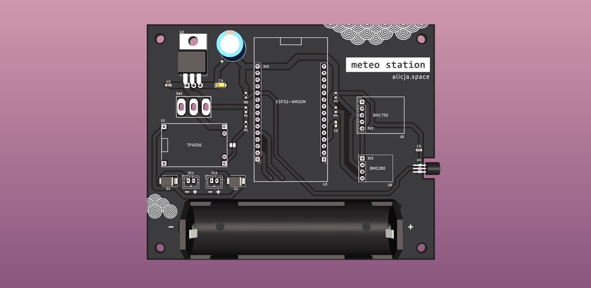
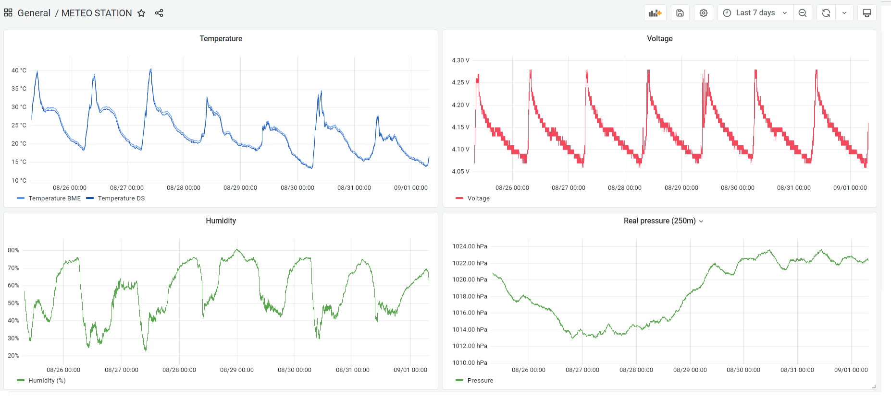
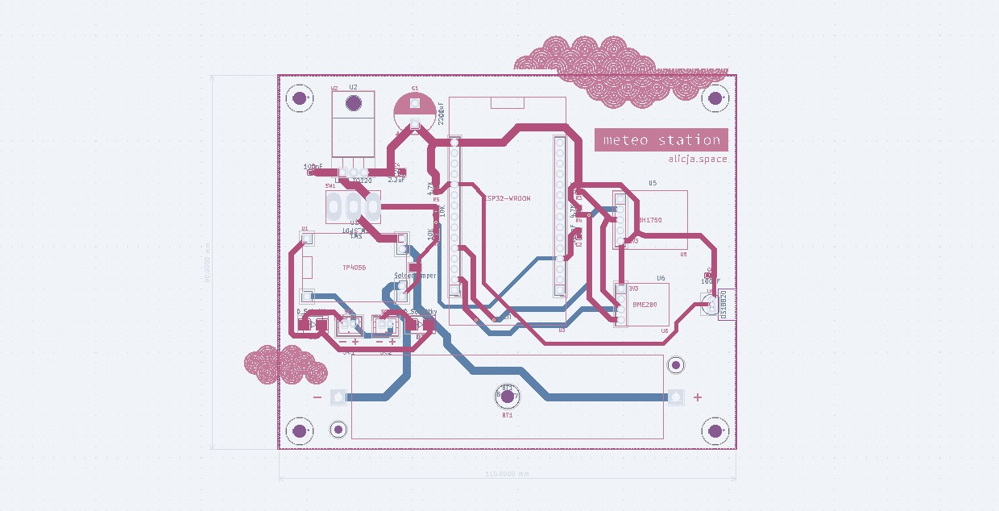
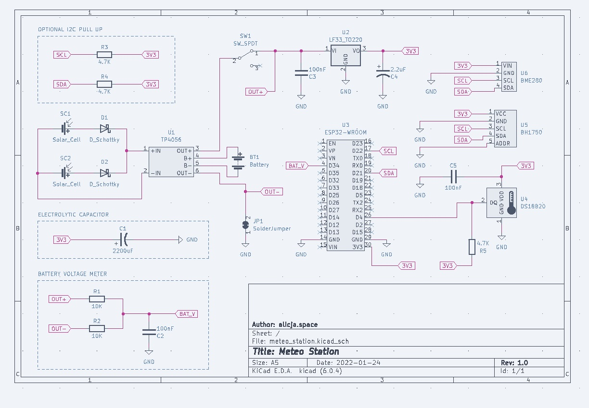

# METEO STATION – PCB based on ESP32 

  
&nbsp; &nbsp; &nbsp;
  

### ◾ About the project

**Meteo station** is my small after-hours project that contains of **three** repositories:
- Meteo station PCB based on ESP32 (this repo)
- [Meteo station code](https://github.com/alicjamusial/meteo-station-code)
- [Meteo station 3D prints](https://github.com/alicjamusial/meteo-station-3d-print)

As the name suggest, is a DIY self-sufficient weather measuring device. I decided to design it as a PCB board with goldpins to stick-in or stick-out individual components and sensors (ESP32, BME280 etc.) to make it more reusable. It could have - of course - been integrated on board, but it would be more expensive and time-consuming to create.

As you can see - the project is designed with minimal effort 🙂 But works!

> **Warning**  
> This is a hobbyist project. I'm not an electronic engineer so I take no responsibility for any possible issues you may encounter :)

Gerber files for version 1.0 of Meteo Station is available [in the releases section](https://github.com/alicjamusial/meteo-station/releases/tag/release-1.0.0).

The board was designed using [KiCad](https://kicad.org/) (version: `6.0`).

I was inspired by solution created by [this guy on Instructables](https://www.instructables.com/Solar-Powered-WiFi-Weather-Station-V30/). He did a good job, so I strongly recommand exploring his meteo projects!

### ◾ Sensors & components
**Components:**
- ESP32 (ESP-WROOM-32) - main computer (with LEDs, LDO, USB-to-UART unsoldered)
- TP4056 - battery charger
- solar panel - I finally used DFRobot FIT0601 Monocrystalline Solar Panel (5V, 1A)
- 18650 battery + holder
- slide switch, LDO etc. - according to the KiCad project

**Sensors:**
- BME280 - humidity, pressure, temperature
- DS18B20 - temperature
- BH1750 - light (should be mounted on cables - outside of the box)

**Other stuff that you may need:**
- access to 3D printer to print a Stevenson cage and solar panel holder
- server (e.g. RaspberryPi) with Influx database and Grafana instance to gather data from the station and display it in a nice way

### ◾ Useful tips

- **important!** - it's a good idea to prepare your ESP32 before placing it in the station - I unsoldered all unnecessary components from it to lower the power consumption. You can see more details on [my twitter](https://twitter.com/alicja_musial/status/1494784125051584515),
- there are two possibilites to connect a solar panel to the PCB - via mini USB in the TP charger or using SC1 and SC2 connectors - depending on which solar panel you buy,
- choose the biggest solar panel you can,
- adjust timings in software to avoid complete discharge of the battery.

### ◾ Adjust it to your needs!
This is an absolutely hobbyst project :) You can use it as a reference to create something loads better.

### ◾ License
Meteo Station PCB is available on Creative Commons Attribution Share Alike 4.0 International license (more in [license file](LICENSE.txt)). You are free to use it, modify it and produce as many of your own boards as you need.

### ◾ Final result

Cable tie and tape for the win ;)

  

